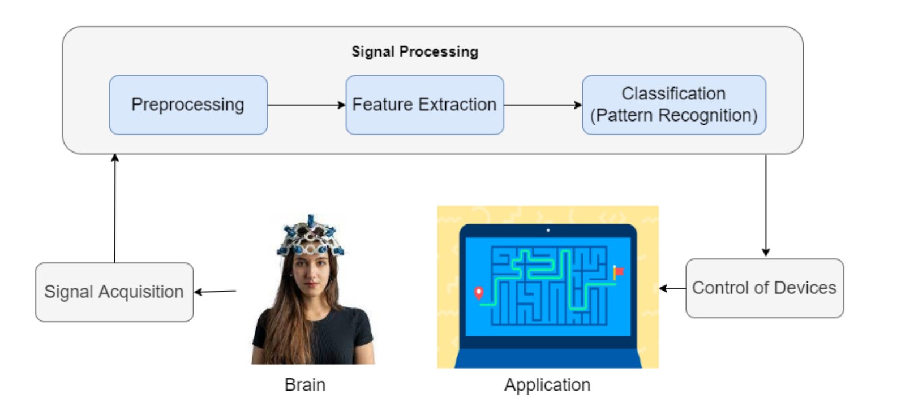
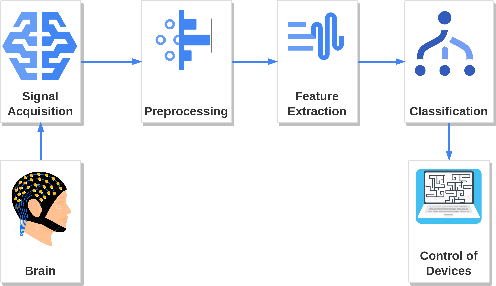

[comment]: # "This is the standard layout for the project, but you can clean this and use your own template"

# Enhancing Video Game Experience With Brain Computer Interface

1. [Abstract](#abstract)
2. [Related works](#related-works)
3. [Methodology](#methodology)
4. [Experiment Setup and Implementation](#experiment-setup-and-implementation)
5. [Results and Analysis](#results-and-analysis)
6. [Conclusion](#conclusion)
7. [Publications](#publications)
8. [Links](#links)

## Abstract

Electroencephalogram (EEG) based Brain-Computer Interfaces (BCIs) were primarily developed to assist individuals with motor disabilities. However, recent studies have investigated the potential of EEG-based BCIs for non-clinical applications, such as gaming. Researchers have found that using non-motor imagery can be an effective way to provide control commands in BCI applications. Various techniques have been explored to decode non-motor imagery tasks using EEG. Inner speech, which is a non-motor imagery task, is a form of self-directed speech produced in mind. In this study we used the inner speech paradigm to decode four control commands namely, left, right, up and down, that can be used for controlling a simple navigation game. Independent Component Analysis (ICA) and Continuous wavelet transform (CWT) were considered as the signal preprocessing techniques. With application of transfer learning for Convolutional Neural Network (CNN), Resnet50, we classified the EEG signals from 9 subjects. The results showed accuracies of 100%, 45%, 20% and 90% for different ratios of training and test data. 

## Related works

There has been some research into using inner speech as a control signal for BCI systems. Several studies have investigated the potential of using inner speech to decode commands from EEG signals.

A study has presented a promising approach for decoding four words, up, down, left and right using a 2D convolutional neural network (CNN) based on the EEGNet architecture [1]. The classification was performed on the raw EEG signals of eight subjects as they internally thought about the four different commands. The results of the study has shown that CNN is able to accurately classify the different types of inner speech, with an average classification accuracy of 29.7%. Usage of such deep learning approaches for inner speech classification can give rise to potential applications, such as development of brain-computer interfaces (BCIs) for communication and controlling assistive devices.

Several studies investigating inner speech decoding have used prompts consisting of words and vowels. Vowel sounds are often preferred as they are considered to be emotionally neutral and acoustically stable [2]. Researchers have also investigated the feasibility of using EEG signals to discriminate between simple and frequently used words such as "Yes" and "No" in response to binary questions [3]. This approach may be particularly useful for individuals who lack communication abilities. The findings suggest that EEG signals can effectively capture the distinctive properties associated with these words, enabling accurate discrimination between them.

A study has explored the current state of inner speech decoding and discusses the limitations of existing methods and algorithms [2]. They propose a new approach based on deep neural networks to improve the accuracy and reproducibility of inner speech decoding, which leverages recent advances in machine learning and signal processing. The study highlights the importance of reproducibility in the field of inner speech decoding and proposes a standardized evaluation framework for comparing different methods and algorithms.

BCI applications are not limited to clinical use, as they can also be used in gaming, entertainment, and 3D virtual environments. Researchers have explored the integration of spatial navigation control for virtual environments [4], which can also be utilized as a prototype control for physical systems like wheelchairs and robotic systems.

## Methodology

Brain-Computer Interface (BCI) is a collaboration between a brain and a device that enables signals from the brain to direct some external activity. In this project, four control actions (left, right, up, and down) will be performed in a video game using BCI. In this approach, inner speech commands will be used as the method to control the video game application. The inner speech, also referred to as verbal thinking, is a form of self-directed speech produced in mind.

One of the main steps in this project is to acquire brain signals related to inner speech. The data acquisition technique to be used is electroencephalography (EEG) which is a non-invasive data acquisition technique. It is aimed to achieve a higher level of performance by capturing the most relevant signals with the use of eight
electrodes.

The signal enhancement and feature extraction will be done using signal processing techniques like signal filtering, independent component analysis (ICA), continuous wavelet transform(CWT) , and short-time Fourier transform (STFT). Then, signals will be classified into five categories using the artificial neural network technique as up, down, left, right, and none. These classified commands are fed into the real-time application.

## Experiment Setup and Implementation

### Subjects
This study involved 9 healthy, right-handed subjects with a mean age of 25 years, of whom 4 were male and 5 were female. The subjects had no speech or hearing loss, no neurological, movement, or psychiatric disorders. All of the subjects gave their written, informed consent. These subjects had no prior BCI experience.

### Data acquisition

The experiment was designed to acquire data from the subjects. Inner speech paradigm was used throughout the experiment.The inner speech paradigm is a psychological concept that refers to the way people talk to themselves silently in their minds.
The final outcome of the conducted research was to control the simple navigation game using four different mind commands. They were up, down, left, and right. In the experiment, the collected data was related to these mind commands of the subjects.
A GUI was developed and used to guide the subject with what to think and when to think. Pyqt5 designer in python was used to design the experiment GUI. Initially, the subject was given a concentration interval of 0.5 seconds. In the next 0.5 seconds interval, the cue was shown up. The cue refers to the direction. After that, the action interval was shown for 2.5 seconds. Within the action interval, the subject was supposed to pronounce the shown direction in mind. Next, the subject was given a relax interval of 1 second and rest interval of 1.5 seconds. 

### Data Preprocessing and Feature Extraction

#### EEG Data

The continuous raw data needed to be restructured in order to do further analysis. The implementation for the real-time transformation of data was done in Python.
Functions were developed to load continuous raw data corresponding to a particular subject and session. This raw data was filtered and tagged corresponding to the GUI event. The structured data stored has information according to the corresponding subject, session, electrodes and events.

#### ICA

Independent Component Analysis (ICA) is a widely used technique for analyzing EEG data. ICA separates the multichannel EEG signal into independent components, each representing a different neural source. In this study FastICA was used, since it is well-suited for large datasets with many channels, and it can handle non-stationary and time-varying signals. Using FastICA the EEG signal was separated into 3 independent components, each representing the activity of a different neural source. These independent components were used as the inputs to the classification model.

ICA can be used to identify and separate artifacts from the EEG data, such as eye movements, muscle activity, and environmental noise. It can also be used to study the functional connectivity between different brain regions by identifying independent components that represent the activity of specific brain networks.

#### Signal data convert into 2d representation.

  In traditional signal classification method use handcrafted signal features. Such as average, magnitude. These types of features are not adiqued build well performing machine learning model. Converting raw eeg data into 2d representation allows better capture the temporal and spectral characteristics of the signal. These representations can be direclty process by neural networks. For this experiment, we employed STFT and CWT. 

##### STFT

The short-time Fourier transform is one of the fundamental signal to image conversion method. The STFT involves dividing a signal into overlapping segments and then computing the Fourier transform of each segment. The resulting spectrogram provides a representation of the frequency content of the signal over time. One advantage of the STFT is that it is computationally efficient, and the resulting spectrogram can be easily visualized and interpreted. But STFT have poor time-frequency  representation. And it lead to underperform the neural network model. 

##### CWT

Compare STFT, CWT (Continuous Wavelet Transform)  can provide a more detailed representation of the temporal and spectral characteristics of the signal. But this techniques  require significant computational resources to implement. On other, CWT offer a rich full information to neural networks, enabling them to better identify patterns and structures in the signal data. The Continuous Wavelet Transform (CWT) involves two steps. First, the data is converted into a CWT matrix (Image 1), and then it is converted into an image (Image 2) using a plotting mechanism. However, in our implementation, we omit the second step to reduce the significant amount of computational power required. And directly pass this CWT matrix into neural network. 

#### Classification models

The classification model is at the core of this research, aimed at distinguishing between different mind commands and assigning them to their corresponding classes. In this study, we experimented with wide range of classification models. 

- Channelless model
- Channelwise model
- Transfer learning (VGG19 and Restnet )

## Results and Analysis

## Conclusion

## References

[1] B. van den Berg, S. van Donkelaar, and M. Alimardani, “Inner speech classification using eeg signals: A deep learning approach,” in 2021 IEEE 2nd International Conference on Human-Machine Systems (ICHMS). IEEE, 2021, pp. 1–4.

[2] F. Simistira Liwicki, V. Gupta, R. Saini, K. De, and M. Liwicki, “Rethinking the methods and algorithms for inner speech decoding and making them reproducible,” NeuroSci, vol. 3, no. 2, pp. 226–244, 2022.

[3] A. R. Sereshkeh, R. Trott, A. Bricout, and T. Chau, “Eeg classification of covert speech using regularized neural networks,” IEEE/ACM Trans- actions on Audio, Speech, and Language Processing, vol. 25, no. 12, pp. 2292–2300, 2017.

[4] A. Curtin, H. Ayaz, Y. Liu, P. A. Shewokis, and B. Onaral, “A p300-based eeg-bci for spatial navigation control,” in 2012 Annual International Conference of the IEEE Engineering in Medicine and Biology Society. IEEE, 2012, pp. 3841–3844

## Publications
[//]: # "Note: Uncomment each once you uploaded the files to the repository"

<!-- 1. [Semester 7 report](./) -->
<!-- 2. [Semester 7 slides](./) -->
<!-- 3. [Semester 8 report](./) -->
<!-- 4. [Semester 8 slides](./) -->
<!-- 5. Author 1, Author 2 and Author 3 "Research paper title" (2021). [PDF](./). -->

#### Team

- E/16/012,  Isurika Adikari, [email](mailto:e16012@eng.pdn.ac.lk)
- E/16/081, J.M.Praveen Dhananjaya, [email](mailto:e16081@eng.pdn.ac.lk)
- E/16/200, Sumudu Liyanage, [email](mailto:e16200@eng.pdn.ac.lk)

#### Supervisors

- Dr. Isuru Nawinne, [email](mailto:isurunawinne@eng.pdn.ac.lk)
- Prof. Roshan G. Ragel, [email](mailto:roshanr@eng.pdn.ac.lk)
- Dr. Mahanama Wickramasinghe, [email](mailto:mahanamaw@eng.pdn.ac.lk)
- Mr. Theekshana Dissanayake, [email](mailto:theekshanadis@eng.pdn.ac.lk)

#### Table of content

## Links

[//]: # ( NOTE: EDIT THIS LINKS WITH YOUR REPO DETAILS )

- [Project Repository](https://github.com/cepdnaclk/e16-4yp-Enhancing-Video-Game-Experience-With-Brain-Computer-Interface)
- [Project Page](https://cepdnaclk.github.io/e16-4yp-Enhancing-Video-Game-Experience-With-Brain-Computer-Interface/)
- [Department of Computer Engineering](http://www.ce.pdn.ac.lk/)
- [University of Peradeniya](https://eng.pdn.ac.lk/)

[//]: # "Please refer this to learn more about Markdown syntax"
[//]: # "https://github.com/adam-p/markdown-here/wiki/Markdown-Cheatsheet"
